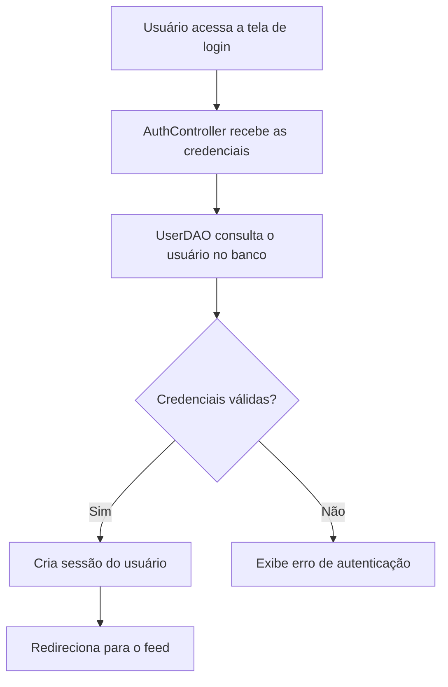
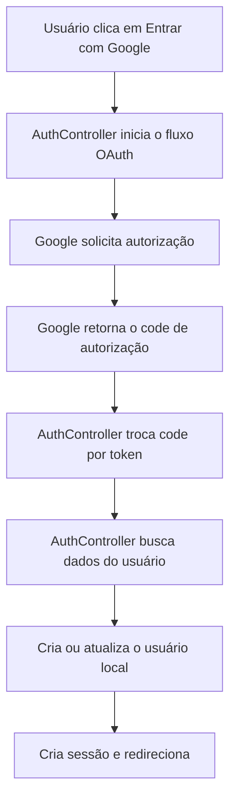

# Módulo de Autenticação e Banco de Dados

## 1. Visão Geral do Módulo

Este módulo é responsável por garantir a identidade do usuário no sistema, controlar o acesso às rotas protegidas e manter a conexão com o banco de dados de forma segura e confiável. Ele integra:

- autenticação tradicional com e-mail e senha;
- autenticação via Google OAuth 2.0;
- persistência com PDO e padrão DAO;
- tratamento de erros e exceções em camadas bem definidas.

O objetivo principal é oferecer um fluxo de login seguro, escalável e compatível com a arquitetura MVC adotada pelo projeto ALTI.

---

## 2. Arquitetura e Estrutura de Arquivos

```text
ALTI/
├── config/
│   └── database.php
├── controllers/
│   ├── AuthController.php
│   ├── MainController.php
│   └── ...
├── models/
│   ├── User.php
│   ├── Post.php
│   ├── Like.php
│   ├── Comment.php
│   ├── Follow.php
│   ├── Models.php
│   └── DAO/
│       ├── UserDAO.php
│       ├── PostDAO.php
│       └── ...
├── views/
│   └── auth.php
├── index.php
└── schema.sql
```

### Papel de cada camada
- Config: centraliza a conexão com o banco e variáveis globais de configuração.
- Controller: recebe entradas do usuário e orquestra validações e fluxo de autenticação.
- DAO: executa operações de leitura, escrita e atualização no banco.
- View: renderiza o formulário de login, cadastro e feedbacks de erro.

### Fluxo arquitetural
1. A View envia dados via POST ou redireciona para o provedor de identidade.
2. O Controller valida as entradas recebidas.
3. O DAO acessa o banco por meio de PDO.
4. O resultado é devolvido ao Controller, que atualiza a sessão e redireciona o usuário.

---

## 3. Camada de Configuração e Banco de Dados (`database.php`)

### 3.1 Responsabilidade da classe `Database`
A classe `Database` é responsável por criar e reutilizar uma única conexão PDO para toda a requisição. Esse padrão reduz overhead e evita múltiplas conexões desnecessárias.

Ela implementa o padrão Singleton e fornece o método estático `getConnection()`.

### 3.2 Constantes de configuração

| Constante | Descrição | Exemplo |
| :--- | :--- | :--- |
| `DB_HOST` | Host do banco de dados | `localhost` |
| `DB_NAME` | Nome do banco | `sistema_de_chat_educacional` |
| `DB_USER` | Usuário do MySQL | `root` |
| `DB_PASS` | Senha do MySQL | `` |
| `DB_CHARSET` | Charset da conexão | `utf8mb4` |

### 3.3 Opções do driver PDO
A conexão utiliza opções importantes para segurança e compatibilidade:

- `PDO::ATTR_ERRMODE => PDO::ERRMODE_EXCEPTION`: lança exceções para falhas SQL.
- `PDO::ATTR_DEFAULT_FETCH_MODE => PDO::FETCH_ASSOC`: retorna dados como arrays associativos.
- `PDO::ATTR_EMULATE_PREPARES => false`: evita emulação de prepared statements.
- `PDO::MYSQL_ATTR_INIT_COMMAND`: define o charset inicial da conexão.

### 3.4 Tratamento de erros
Em caso de falha na conexão, o sistema:

- registra o erro em log interno;
- envia resposta HTTP 500;
- encerra a execução com mensagem amigável ao usuário.

Exemplo:

```php
try {
    $pdo = Database::getConnection();
} catch (PDOException $e) {
    error_log('Erro de conexão: ' . $e->getMessage());
}
```

---

## 4. Fluxos de Autenticação (Detalhamento Técnico)

### A. Autenticação Tradicional (E-mail e Senha)

#### Objetivo
Validar as credenciais fornecidas pelo usuário e criar uma sessão autenticada.

#### Fluxo
1. A View envia `email` e `password` via `POST`.
2. O `AuthController` recebe os dados.
3. O controller valida:
   - preenchimento dos campos;
   - formato válido do e-mail;
   - tamanho mínimo da senha;
4. O controller chama o `UserDAO` para localizar o usuário pelo e-mail.
5. O DAO consulta a tabela `users`.
6. Se a senha for validada com `password_verify()`, o sistema grava os dados na sessão e redireciona o usuário para o feed.

#### Exemplo conceitual
```php
$user = $userDAO->findByEmail($email);

if ($user && password_verify($password, $user['password_hash'])) {
    $_SESSION['user_id'] = $user['id'];
    $_SESSION['user_name'] = $user['name'];
    $_SESSION['user_type'] = $user['user_type'];
}
```

#### Observações de segurança
- A senha nunca é armazenada em texto puro.
- O hash é verificado diretamente pelo DAO/Controller sem expor dados sensíveis.
- A sessão é o mecanismo de controle de acesso para rotas protegidas.

### B. Autenticação via Google OAuth 2.0

#### Objetivo
Permitir login utilizando a conta Google do usuário, sem necessidade de criar uma senha local.

#### Fluxo principal
1. O usuário clica em “Entrar com Google”.
2. O sistema gera um `state` e redireciona o navegador para a URL de autorização do Google.
3. O Google autentica o usuário e redireciona de volta para o endpoint configurado como callback.
4. O sistema recebe o `code` de autorização e troca por um token de acesso.
5. O token é usado para buscar os dados do usuário no endpoint `/userinfo`.
6. O sistema verifica se o e-mail já existe. Se não existir, cria um novo usuário local.
7. A sessão é criada e o usuário é redirecionado para o feed.

#### Importância do URI de redirecionamento
O `redirect_uri` é essencial para o fluxo OAuth. Sem ele corretamente configurado, o Google não retornará o código de autorização para a aplicação.

Exemplo esperado:
```text
http://localhost:8080/index.php?action=google_callback
```

#### Requisitos mínimos no Google Cloud Console
No painel do Google Cloud Console, é necessário configurar:

- `Origins JavaScript autorizados`:
  - `http://localhost:8080`
- `URIs de redirecionamento autorizados`:
  - `http://localhost:8080/index.php?action=google_callback`

#### Segurança recomendada
- manter `GOOGLE_CLIENT_ID` e `GOOGLE_CLIENT_SECRET` fora do código-fonte;
- usar variáveis de ambiente ou arquivo de configuração seguro;
- validar o `state` retornado para evitar CSRF.

---

## 5. Referência da API Interna (Classes e Métodos)

### 5.1 Classe `Database`

| Nome | Modificador | Descrição |
| :--- | :--- | :--- |
| `getConnection()` | público | Retorna a instância única da conexão PDO. |
| `__construct()` | privado | Impede instanciação externa da classe. |
| `__clone()` | privado | Impede clonagem da conexão. |

### 5.2 Classe `UserDAO`

| Nome | Modificador | Descrição |
| :--- | :--- | :--- |
| `findByEmail()` | público | Busca um usuário pelo e-mail. |
| `findById()` | público | Busca um usuário pelo ID. |
| `create()` | público | Cria novo usuário com hash de senha. |
| `updateAccount()` | público | Atualiza dados cadastrais do usuário. |
| `deleteById()` | público | Remove um usuário do banco. |
| `emailExistsForOtherUser()` | público | Verifica se o e-mail já pertence a outro usuário. |
| `emailExists()` | público | Verifica se o e-mail já está cadastrado. |
| `searchPeople()` | público | Busca usuários/instituições por termo parcial. |

### 5.3 Classe `AuthController`

| Nome | Modificador | Descrição |
| :--- | :--- | :--- |
| `showAuth()` | público | Exibe a tela de login/cadastro. |
| `doLogin()` | público | Processa autenticação tradicional. |
| `doRegister()` | público | Realiza cadastro de novo usuário. |
| `doGoogleLogin()` | público | Inicia o fluxo OAuth com o Google. |
| `doGoogleCallback()` | público | Processa o retorno do Google após a autenticação. |
| `doLogout()` | público | Encerra a sessão do usuário. |
| `fetchGoogleToken()` | privado | Troca o `code` por token de acesso. |
| `fetchGoogleUserInfo()` | privado | Busca dados do usuário no endpoint do Google. |
| `httpPostForm()` | privado | Envia requisições HTTP para o provedor OAuth. |
| `getGoogleClientId()` | privado | Obtém o `client_id` do Google. |
| `getGoogleClientSecret()` | privado | Obtém o `client_secret` do Google. |
| `getGoogleRedirectUri()` | privado | Monta o URI de retorno do callback. |

---

## 6. Pré-requisitos de Ambiente e Instalação Local

### Requisitos mínimos
- PHP 8.1 ou superior.
- MySQL 8.0 ou superior.
- Servidor web local como Apache, Nginx, XAMPP, WAMP ou Laragon.
- Extensão PDO para MySQL habilitada.
- Acesso ao console do MySQL para importar o schema.

### Passos de instalação
1. Clone o projeto para a pasta do seu servidor local.
2. Crie o banco de dados MySQL e importe o conteúdo de [schema.sql](../schema.sql).
3. Ajuste as credenciais de conexão em [config/database.php](../config/database.php) ou em um arquivo de ambiente seguro.
4. Inicie o servidor local e acesse a aplicação pelo navegador.
5. Acesse a tela de autenticação para validar o fluxo de login e cadastro.

### Observação
O projeto já está preparado para rodar com uma estrutura MVC simples. Para ambientes de produção, é recomendável separar ainda mais os segredos em variáveis de ambiente e bloquear acesso direto aos arquivos de configuração.

---

## 7. Exemplo de Configuração com .env

A seguir, um exemplo de estrutura recomendada para variáveis de ambiente:

```env
DB_HOST=localhost
DB_NAME=alti
DB_USER=root
DB_PASS=
DB_CHARSET=utf8mb4

GOOGLE_CLIENT_ID=seu_client_id
GOOGLE_CLIENT_SECRET=seu_client_secret
GOOGLE_REDIRECT_URI=http://localhost:8080/index.php?action=google_callback
```

### Recomendação prática
- Nunca versionar o arquivo `.env` real no repositório.
- Criar um arquivo `.env.example` como modelo de referência.
- Carregar os valores em tempo de execução por meio de uma camada de configuração centralizada.

---

## 8. Diagrama de Fluxo de Autenticação



### Fluxo OAuth com Google


---

## 9. Boas Práticas Recomendadas

- Armazenar credenciais sensíveis em variáveis de ambiente ou arquivo externo não versionado.
- Usar `try/catch` sempre que houver interação com banco, HTTP externo ou sessão.
- Preferir prepared statements com PDO para evitar SQL Injection.
- Validar dados recebidos na entrada antes de persistir ou autenticar.
- Registrar erros em logs em vez de expor detalhes internos para o usuário.

---

## 10. Resumo Executivo

O módulo de autenticação e banco de dados do ALTI oferece uma base sólida para login tradicional e OAuth com Google, mantendo uma arquitetura organizada em MVC, DAO e camadas bem separadas. A combinação entre segurança, tratamento de erros e boa estrutura modular torna o sistema mais preparado para evolução, manutenção e integração com novos provedores de identidade.
